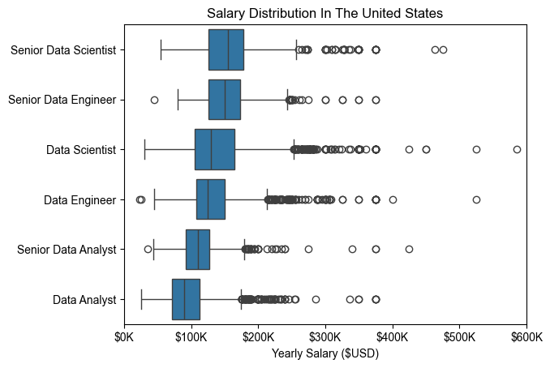
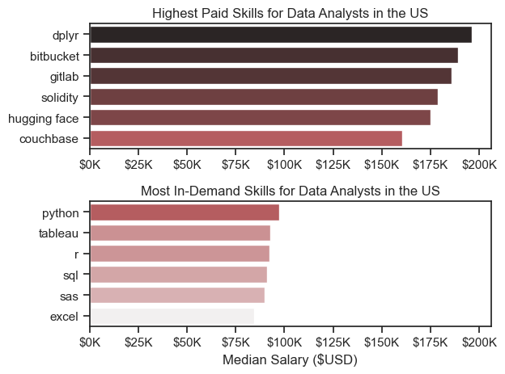

# Overview

Welcome to my analysis of the data job market, focusing on data analyst roles. The project was created in the learning process inspired by Course Source: [Python for Data Analytics – Full Course](https://www.youtube.com/watch?v=wUSDVGivd-8) by [Luke Barousse](https://www.youtube.com/@LukeBarousse)

If you already know python, you can follow through the course using this guide especially if you want to run things locally in your pc.

This is the data set I explored [Data_Jobs](https://drive.google.com/file/d/1LCqJ8an72nX11p_WXh7OnIOECEv0Vovq/view?usp=drive_link)


# The Questions
Below are the questions I want to answer in my project:

What are the skills most in demand for the top 3 most popular data roles?
How are in-demand skills trending for Data Analysts?
How well do jobs and skills pay for Data Analysts?
What are the optimal skills for data analysts to learn? (High Demand AND High Paying)

# Tools I Used
For my deep dive into the data analyst job market, I harnessed the power of several key tools:

Python: The backbone of my analysis, allowing me to analyze the data and find critical insights.I also used the following Python libraries:
Pandas Library: This was used to analyze the data.
Matplotlib Library: I visualized the data.
Seaborn Library: Helped me create more advanced visuals. 
Jupyter Notebooks: The tool I used to run my Python scripts which let me easily include my notes and analysis.
Visual Studio Code: My go-to for executing my Python scripts. I did all my task locally.
Git & GitHub: Essential for version control and sharing my Python code and analysis, ensuring collaboration and project tracking.

# Data Preparation and Cleanup
This section outlines the steps taken to prepare the data for analysis, ensuring accuracy and usability.

# Import & Clean Up Data
I start by importing necessary libraries and loading the dataset, followed by initial data cleaning tasks to ensure data quality.

```python
import ast
import pandas as pd
import numpy as np
import matplotlib.pyplot as plt

# Load dataset
df = pd.read_csv(r"C:\Users\Admin\OneDrive\Desktop\Data Analysis And Automation\Sample Data\data_jobs.csv")
df.head()

# Cleaning the dataset
df['job_posted_date'] = pd.to_datetime(df.job_posted_date)
df['job_skills'] = df['job_skills'].apply(lambda x: ast.literal_eval(x) if isinstance(x, str) else x)

```


# The Analysis

## 1. What are the most in-demand skills for the top 3 popular data roles?

To identify the most in-demand skills for the top three data roles, I filtered job postings to determine the most popular positions and then extracted the top five skills required for each role.

This analysis highlights the most sought-after job titles and their key skills, helping identify which technical skills to focus on depending on a target role (Python for Data Analysis).

View the full notebook here:  
[02_Skill_Demand.ipynb](03_Projects/02_Skill_Demand.ipynb)


## Visualization

The chart below shows the likelihood of specific skills appearing in job postings for the top three data roles.


## Insights

- **Python** is a versatile and highly demanded skill across all three roles, with the strongest demand among **Data Scientists (72%)** and **Data Engineers (65%)**.
- **SQL** is the most requested skill for **Data Analysts** and **Data Scientists**, appearing in over half of job postings for both roles.
- **Data Engineers** require more specialized technical skills such as **AWS, Azure, and Spark**, while **Data Analysts** and **Data Scientists** are expected to be proficient in more general data analysis and visualization tools like **Excel** and **Tableau**.


## 📊 How Are In Demand Top Skills for Data Analysts Trending in the US (2023)

## 📌 Project Overview

This project analyzes **trending technical skills for Data Analyst roles in the United States** during 2023. It is designed as a **portfolio project for junior to mid-level Data Analysts**, focusing on clear analysis, practical insights, and strong communication.

The goal of the project is to understand **which skills appear most frequently in job postings** and how their demand changes month by month. This mirrors the type of analysis a Data Analyst might perform to support **career planning, workforce analysis, or market research**.

The analysis focuses on five commonly requested skills:


* **SQL**
* **Excel**
* **Python**
* **Tableau**
* **Power BI**


## 🎯 Objective

The objectives of this project are to:

* Practice **exploratory data analysis (EDA)** using Python
* Analyze **job market trends** using time-based data
* Create a **clear and readable visualization** that highlights insights
* Communicate findings in a way that is easy for **non-technical stakeholders** to understand

This project demonstrates the ability to go from **data → visualization → insight**, which is a key expectation for junior and mid-level Data Analysts.


## 🧠 Key Insights

### 1️⃣ SQL – Highest Demand Throughout the Year

* SQL consistently appears in **over half of job postings** across all months.
* Although demand slightly decreases toward the end of the year, SQL remains the most requested skill.

**Takeaway:** SQL is a **core requirement** for Data Analyst roles at all levels.


### 2️⃣ Excel – Strong and Consistent Demand

* Excel demand stays around **40–45%** for most of the year.
* A short dip appears in October and November, followed by a recovery in December.

**Takeaway:** Excel continues to be a **foundational tool**, especially for reporting and business analysis.


### 3️⃣ Python – Gradual Growth

* Python shows a steady increase in demand over the year.
* This suggests growing use of Python for **data cleaning, automation, and deeper analysis**.

**Takeaway:** Python is an important skill for analysts looking to move beyond basic reporting.


### 4️⃣ Tableau – Moderate but Declining Trend

* Tableau demand peaks mid-year and slightly declines toward the end.
* Despite the decline, it remains a commonly requested visualization tool.

**Takeaway:** Visualization skills are important, but tool choice may vary by company.


### 5️⃣ Power BI – Stable Demand

* Power BI shows steady demand throughout the year at around **20–22%**.
* Often preferred in organizations that use Microsoft tools.

**Takeaway:** Power BI is a useful complementary skill for Data Analysts.


## 🛠️ Tools & Technologies

* **Python** – data analysis
* **Pandas** – data cleaning and manipulation
* **Matplotlib** – data visualization
* **Jupyter Notebook** – analysis and documentation


## 📈 Visualization

```python
df_plot = df_DA_US_percent.iloc[:, :5]

sns.lineplot(data=df_plot, dashes=False, palette='tab10')
sns.set_theme(style='ticks')
sns.despine()
plt.title('Trending Top Skills For Data Analysts In US')
plt.ylabel('Likelihood Of Job Postings')
plt.xlabel('2023')
plt.legend().remove()

from matplotlib.ticker import PercentFormatter
ax = plt.gca()
ax.yaxis.set_major_formatter(PercentFormatter(decimals=0))

for i in range(5):
    plt.text(11.2, df_plot.iloc[-1, i], df_plot.columns[i])

```


📊 View the full notebook here:  
[03_Skills_Trend.ipynb](03_Projects/03_Skills_Trend.ipynb)


## 🚀 Next Steps

Future improvements for this project could include:
* Comparing multiple years of job market data
* Breaking down trends by **experience level or industry**
* Adding salary analysis alongside skill demand


## ✅ Conclusion

This project shows how Python and basic data analysis tools can be used to explore **real-world job market data**. The results highlight the continued importance of SQL and Excel, along with growing demand for Python.


## 3 How well do job skills pay for Data Analysts

## Salary Analysis For Data Roles

```python
plt.title('Salary Distribution In The United States')
plt.xlabel('Yearly Salary ($USD)')
plt.ylabel('')
ax = plt.gca()
ax.xaxis.set_major_formatter(plt.FuncFormatter(lambda x, pos: f'${x/1000:.0f}K'))
plt.xlim(0, 600000)
```

## Results 


box plot

here is the barchart of the same



📊 View the full notebook here:  
[04_Skills_Analysis.ipynb](03_Projects/04_Salary_Analysis.ipynb)


## Insights
“How well do job skills pay for Data Analysts?” based on the boxplot and the barchart 👇

Data Analyst roles offer competitive mid-range salaries, with relatively tight distributions, indicating more standardized pay compared to engineering and scientist roles.

Earning potential increases significantly with advanced technical skills, as seen in higher salary ranges for Data Scientists and Data Engineers.

Outliers show that strong skill specialization and experience can push Data Analyst–adjacent roles into higher salary brackets, especially at senior levels.

# The Analysis

## 4. What are the most optimal skills to learn for Data Analysts?

### Visualisation

```python
plt.scatter(df_DA_skills_high_demand['skill_percent'], df_DA_skills_high_demand['median_salary'])

plt.show()
```


This Scatter plot shows most optimal skills (high paying & high demand) for data analysts in the US

See the full notebook here [05_Optimal_Skills](03_Projects/05_Optimal_Skills.ipynb)

# Insights:

The skill Oracle appears to have the highest median salary of nearly $97K, despite being less common in job postings. This suggests a high value placed on specialized database skills within the data analyst profession.

More commonly required skills like Excel and SQL have a large presence in job listings but lower median salaries compared to specialized skills like Python and Tableau, which not only have higher salaries but are also moderately prevalent in job listings.

Skills such as Python, Tableau, and SQL Server are towards the higher end of the salary spectrum while also being fairly common in job listings, indicating that proficiency in these tools can lead to good opportunities in data analytics.


# What I Learned
Throughout this project, I deepened my understanding of the data analyst job market and enhanced my technical skills in Python, especially in data manipulation and visualization. Here are a few specific things I learned:

Advanced Python Usage: Utilizing libraries such as Pandas for data manipulation, Seaborn and Matplotlib for data visualization, and other libraries helped me perform complex data analysis tasks more efficiently.
Data Cleaning Importance: I learned that thorough data cleaning and preparation are crucial before any analysis can be conducted, ensuring the accuracy of insights derived from the data.
Strategic Skill Analysis: The project emphasized the importance of aligning one's skills with market demand. Understanding the relationship between skill demand, salary, and job availability allows for more strategic career planning in the tech industry.


# Insights
This project provided several general insights into the data job market for analysts:

Skill Demand and Salary Correlation: There is a clear correlation between the demand for specific skills and the salaries these skills command. Advanced and specialized skills like Python and Oracle often lead to higher salaries.
Market Trends: There are changing trends in skill demand, highlighting the dynamic nature of the data job market. Keeping up with these trends is essential for career growth in data analytics.
Economic Value of Skills: Understanding which skills are both in-demand and well-compensated can guide data analysts in prioritizing learning to maximize their economic returns.


# Challenges
This project had its challenges, but it provided good learning opportunities:

Data Inconsistencies: Handling missing or inconsistent data entries requires careful consideration and thorough data-cleaning techniques to ensure the integrity of the analysis.
Complex Data Visualization: Designing effective visual representations of complex datasets was challenging but critical for conveying insights clearly and compellingly.
Balancing Breadth and Depth: Deciding how deeply to dive into each analysis while maintaining a broad overview of the data landscape required constant balancing to ensure comprehensive coverage without getting lost in details.


# Conclusion
This exploration into the data analyst job market has been incredibly informative, highlighting the critical skills and trends that shape this evolving field. The insights I got enhance my understanding and provide actionable guidance for anyone looking to advance their career in data analytics. As the market continues to change, ongoing analysis will be essential to stay ahead in data analytics. This project is a good foundation for future explorations and underscores the importance of continuous learning and adaptation in the data field.